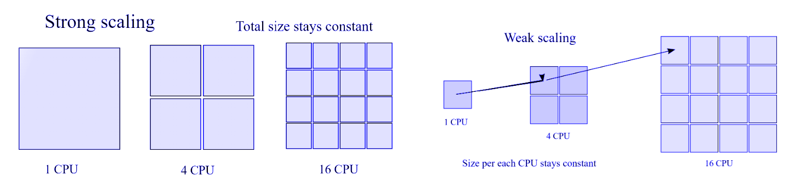
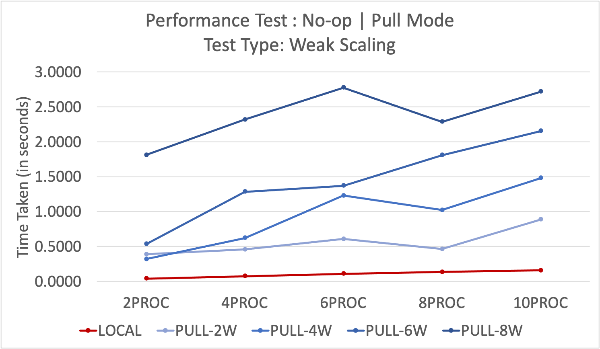
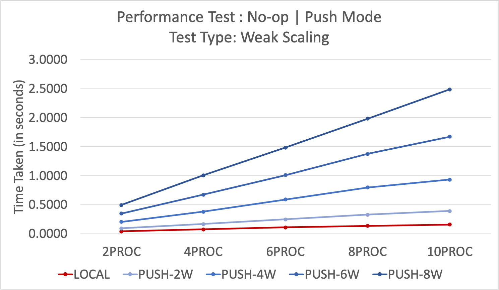
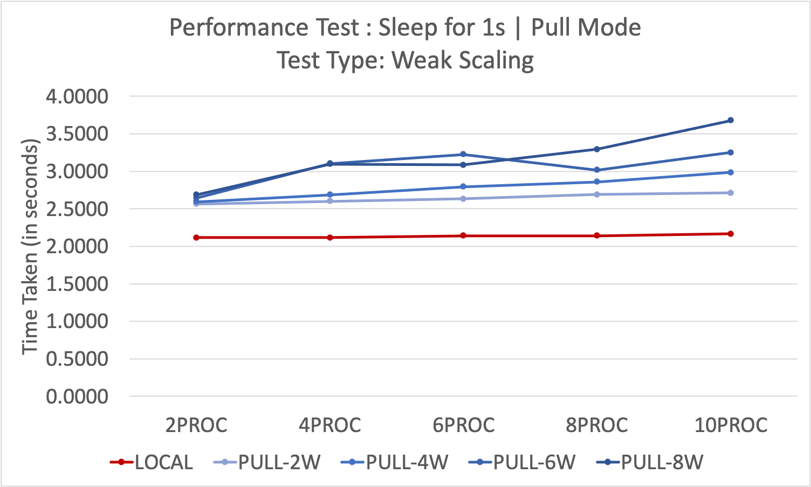
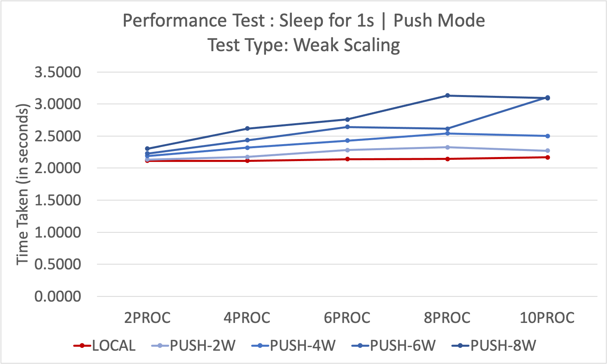
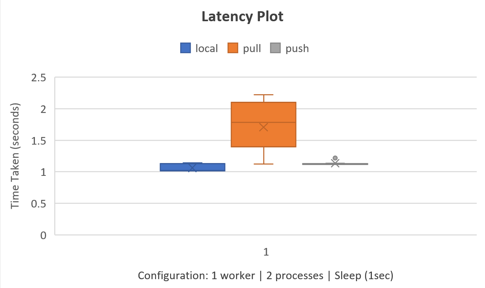

## Performance Report

### Weak Scaling v/s Strong Scaling
Strong scaling is defined as how the solution time varies with the number of processors for a fixed total problem size. Weak scaling is defined as how the solution time varies with the number of processors for a fixed problem size per processor.

#### Performance Testing
We conducted performance test using two functions: no-op and sleep (1s sleep). The results are summarized below. Since the performance test varies from system to system, below are the system specifications:
- [x] Cores: 8
- [x] RAM: 16.0 GB
- [x] Processor: AMD Ryzen 7 4800HS

#### Performance Test: No-op | Pull and Push Mode
We conducted the performance test using the no-op and saw the following trend. But what we observed is that the performance measurement with no-op is not the best baseline. This is because the overhead of the socket programming and ZMQ communication pattern used in the program is more significant than the computation required by no-op. 

The reason, we found by reading on the web, is that a no-op operation does not consume any significant computational resources but it may still introduce some overhead due to context switching, cache misses, and other factors which can lead to thrashing and consequently impact the performance graph. 

In the graph, we can observe that both pull and push modes show significantly different processing times when compared to the no-op operations. As the number of tasks increases, the time taken increases significantly, owing to the context switching and locking

    
    

#### Performance Test: Sleep | Pull and Push Mode
When compared to the no-op function, the sleep function performance measurement shows that both implementations were pretty close to LOCAL mode. The overhead of the ZMQ communication and socket programming was not very significant in this case.

As the number of tasks increases, the performance drop is negligible with little deviation from the baseline. In comparison between PULL and PUSH,

    
    

#### Latency and Throughput

      

